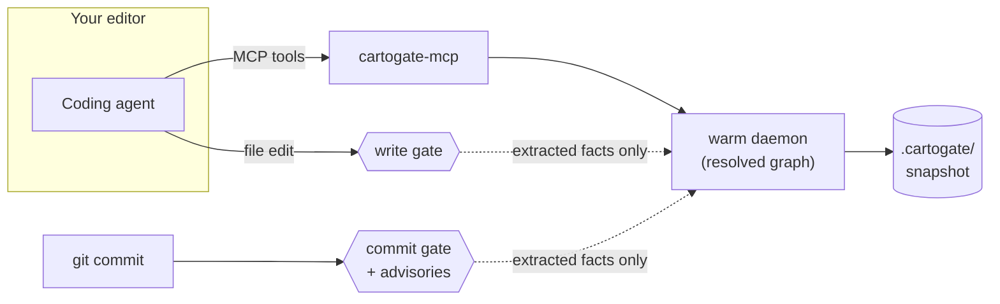

# Cartogate

**A local code-knowledge graph and a deterministic gate for AI coding agents.**

Cartogate builds a typed graph of your codebase — functions, classes, calls, imports, tests, and
docs — and serves it to coding agents through fast, deterministic tools. It prevents two failure
modes that plague agent-assisted development: re-implementing a function that already exists, and
silently breaking a public contract. It runs entirely on your machine — no cloud, no network
calls, no language model of its own — and every answer traces back to a line of source.

Supported languages: Python, TypeScript, JavaScript, Java, Go, Rust, C#, C, C++, Kotlin, Swift.

## Quick start

Requires **Python 3.11+** and **git**.

```bash
pipx install "git+https://github.com/cartogate/cartogate.git@stable"

cd your-repo
cartogate init                    # advisory setup: MCP config + a warm background daemon
cartogate init --agent cursor     # full adoption: always-on rule + write-time and commit gates
                                  # (agents: claude | cursor | windsurf | vscode | codex)
```

`init` is idempotent and merge-safe. The default is non-invasive — it writes nothing into your
repo except MCP configuration; naming a tool with `--agent` opts into the opinionated surfaces
(the rule file, the in-loop write gate, and the blocking pre-commit hook). Every run ends with
an `active surfaces` summary showing exactly what is enabled. `--dry-run` previews any run
without writing.

Upgrading is one command — daemons detect a version mismatch and replace themselves on the next
tool call:

```bash
pipx install --force "git+https://github.com/cartogate/cartogate.git@stable"
```

> **Renamed from GraphGate** (July 2026). Upgrading from a `graphgate` install: uninstall it
> (`pipx uninstall graphgate`), install `cartogate`, then re-run `cartogate init --agent <tool>`
> in each repo — it rewrites the MCP config, rules, and hooks under the new name. Old
> `GRAPHGATE_*` environment variables are no longer read (use `CARTOGATE_*`), and stale
> `.graphgate/` state directories can simply be deleted.

`stable` always points at the latest tagged release; use `@main` for the development tip, or
`@v0.2.0`-style tags to pin an exact version.

## The tools

Cartogate exposes 13 MCP tools. One can block; the rest are advisory and never will.

| Tool | Purpose |
|---|---|
| `check_duplicate` | **The gate.** Before creating a function/class: does this signature already exist? |
| `find_symbol` | Look up a symbol by bare, partial, or fully-qualified name |
| `find_references` | Who calls or references a symbol |
| `blast_radius` | Everything that depends on a symbol, to a chosen depth |
| `impact_summary` | Affected code + tests + docs for a change, in one report |
| `suggest_tests` | Which tests exercise the changed symbols |
| `doc_drift` | Which docs reference the changed symbols and may now be stale |
| `localize` | Rank likely culprits behind a failing test, given a diff |
| `slice` | Program slice: the statements that affect (or are affected by) a line |
| `find_cycles` | Module-level dependency cycles |
| `find_duplicate_bodies` | Copy-pasted function bodies, even across renames |
| `find_dead_code` | Unreferenced internal symbols |
| `set_workspace` | Point the server at a project when the editor provides no workspace signal |

Lookups accept bare names, dotted suffixes, or fully-qualified names; misses return
candidates instead of empty results. Every tool takes an optional `workspace_root`, so an
agent's first call configures the workspace and runs in one round trip.

Two properties are load-bearing:

- **Only extracted facts gate.** A block is only ever issued on facts read directly from source.
  Inferred information (type inference, heuristics) informs advisory answers but can never block.
  Precision rules are per kind: functions block on a matching signature (a re-implementation);
  classes/interfaces block only on a matching body (true copy-paste) — a shared name is not
  evidence.
- **Determinism.** The same tree produces byte-identical answers, across processes and machines.

## How it works



A per-repository daemon keeps the resolved graph warm; queries answer in milliseconds. Each
editor window finds its project automatically (pin, workspace signal, or live-daemon registry),
and the agent can set it explicitly (`workspace_root` / `set_workspace`).

The commit gate re-indexes in-process — independent of the daemon — and judges **the change,
not the history**: only duplicates the staged diff introduces block; pre-existing debt is a
one-line note. The same run prints deterministic advisories (they inform, never block):

| Advisory | Fires when |
|---|---|
| Reference integrity | an established signature changed — with old → new evidence and a `follow-through` line (callers, tests, docs this commit didn't touch) |
| Test integrity | source and tests changed together while assertions dropped, skips appeared, or tests vanished |
| New cycles | the change introduces an import cycle (pre-existing ones are never re-accused) |
| Deletions | a symbol was removed while other code still references it |

Every judgment has one shape: what happened → extracted evidence with file:line → the one
sanctioned action. Passing runs stamp the staged tree, so `cartogate stats` / `doctor` report
which recent commits entered without the gate.

## Results

Precision and cost measured on real third-party repositories with independent oracles (pyright,
coverage.py). Methodology, per-symbol data, and reproduction commands are in
[`docs/VALUE_STUDY.md`](./docs/VALUE_STUDY.md).

<!-- VALUE:START -->

Scored on two real third-party repositories — **click 8.1.7** (a CLI application) and **jmespath 1.0.1** (a library), indexed read-only. P = precision, R = recall.

| KPI | What it measures | click (CLI) | jmespath (library) |
|---|---|---|---|
| **V1** Agent token use | tokens to answer, with vs. without Cartogate | **−78.3%** | — |
| **V2** Query latency | graph query vs. `grep` over the tree | 824× faster, 0.210 ms p95 | — |
| **V3** Reference precision / recall | `find_references` vs. **pyright** | 1.00 / 0.81 (grep P 0.82) | 1.00 / 1.00 (grep P 0.41) |
| **V4** Duplicate precision | `check_duplicate` vs. name-`grep` | 1.00 (grep 0.33) | 1.00 (grep 0.33) |
| **V7** Test-selection precision / recall | `suggest_tests` vs. **coverage.py** | 0.88 / 0.04 | 1.00 / 0.06 |
| **V8** Determinism | identical output across processes | byte-identical | — |
| **V9** Soundness | inferred facts never gate; method scoping | 0 false blocks (199 excluded) | — |
| **V10** Scaling | gate latency, 1k → 50k symbols | flat, ≤ 0.150 ms p95 | — |

Precision is the load-bearing property: Cartogate never reports a wrong reference or a false duplicate, and `suggest_tests` keeps precision high by naming only the directly-reachable tests. V7's low *recall* is intrinsic, not a miss — only 6% (jmespath) / 61% (click) of these symbols' runtime test-coverage is reachable by any static path; the rest is dynamic dispatch (getattr tables, `runner.invoke`) no sound static analyzer can follow. Chasing the rest needs deep traversal that collapses precision (click: P 0.88→0.08 as recall climbs), so the tool stays at depth 1. The full depth curve and per-symbol data are in [`docs/VALUE_STUDY.md`](./docs/VALUE_STUDY.md). Reproduce the deterministic rows with `pytest -m value` and the real-repo rows with `python -m evaluation.realstudy.run_realstudy --corpus {click,jmespath}`.

<!-- VALUE:END -->

These results cover two repositories plus Cartogate's own source; broader corpora and further
trials are tracked on the [roadmap](./docs/dev/ROADMAP.md).

## CLI reference

`carto` is installed as a short alias for `cartogate` - every command below works with
either.

```text
cartogate init      set up this repo (MCP + daemon); --agent <tool> adds rules + commit gate
cartogate daemon    start | stop [--all] | status — manage the warm per-repo daemon
cartogate index     build/refresh the persistent graph snapshot
cartogate hooks     install git hooks that refresh the snapshot on commit/merge/checkout
cartogate doctor    health check: daemon, live gate probe, hook wiring
cartogate stats     what Cartogate knows about this repo + blocks it has issued
cartogate viz       export the graph (GraphML / JSON / interactive HTML) to .cartogate/viz
cartogate impact    PR-time impact summary from a git diff
cartogate localize  rank likely culprits behind a failing test
cartogate cfg       statement-level unreachable-code detection
cartogate slice     program slice for a file:line
```

## Troubleshooting

- `cartogate doctor` verifies the daemon, gate, and hook wiring end to end.
- Mention `@cartogate` in your editor's chat to see the server's live status: workspace, serving
  mode, and version.
- Logs: `<repo>/.cartogate/mcp.log` and `daemon.log`; native crashes land in `crash.log`. The log
  always records the running version and how the process exited.
- If `pipx install --force` reports the venv is locked, run `cartogate daemon stop --all` first.

## Documentation

- [`docs/INTEGRATIONS.md`](./docs/INTEGRATIONS.md) — per-editor setup: Windsurf, Cursor, VS Code,
  Claude Code, Codex.
- [`evaluation/`](./evaluation/) — the value study, benchmarks, and reproduction harnesses.
- [`docs/RELEASING.md`](./docs/RELEASING.md) and [`docs/CI.md`](./docs/CI.md) — release
  procedure and the CI pipeline.

## Development

```bash
git clone https://github.com/cartogate/cartogate.git && cd cartogate
python -m venv .venv && ./.venv/Scripts/python -m pip install -e ".[dev]"
pytest && ruff check . && mypy src      # the gate every change must pass
pytest -m benchmark                     # worst-case-scale SLO benchmark
pytest -m value                         # the deterministic value study
```

Versions are derived from git (`0.1.1.devN+g<hash>`), so any installed build identifies its exact
commit via `cartogate --version`. CI runs the same gate on Linux and Windows across Python 3.11
and 3.12; see [`docs/CI.md`](./docs/CI.md).

## License

Apache-2.0 — see [`LICENSE`](./LICENSE).
